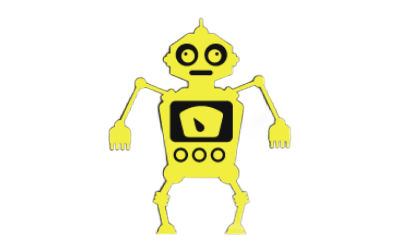

<h1 align="center">cppturtle</h1>
<p align="center">

<br>


</p>
<br>
This project is an implementation of the python turtle library in C++ (using SDL as a dependency for rendering), created with the goals of being fast, easy to use and being able to allow people of all skillsets to
produce cool looking graphics. Additionally, it is also perfect for beginners trying to learn C++ as using this library provides a fun way to learn the syntax of the language while creating cool graphics/images!

- - -

**IMPORTANT:** This library is still very much work in progress and probably will be for a decent amount of time. I am currently working on this project by myself and I would not recommend using this library on any serious projects **yet** as there is probably some unknown bugs.

- - -


## Example usage
```cpp
(NO EXAMPLE YET, CPPTURTLE STILL AT EARLY STAGES OF DEVELOPMENT)
```

## Installation
To install the library, download or copy paste the all cpp/hpp files in the [cppturtle folder](https://github.com/davidfiliks/cppturtle/tree/main/cppturtle) to your project.

After this, you need to install SDL2 as it is a dependency of the library. For linux systems, you should be able to just use your package manager to install SDL2.
Here is an example using the ubuntu package manager.
```bash
sudo apt-get install libsdl2-dev
```

For windows systems, it is a bit more difficult. You need to download [SDL2](https://github.com/libsdl-org/SDL/releases/download/release-2.28.5/SDL2-devel-2.28.5-VC.zip) from this hyperlink and unzip it.
Next you will have to create a new enviroment variable under the user variables section called ***CMAKE_PREFIX_PATH*** and set the value to the full top-level directory of the unzipped SDL2 download. The folder's
name should be **SDL2-2.28.5**.

Alternatively, on **Windows 10 build 17063 or later** you could also use cmd to install it by **cd**'ing into the wanted download directory and pasting these commands one by one.
```bash
certutil.exe -urlcache -split -f "https://github.com/libsdl-org/SDL/releases/download/release-2.28.5/SDL2-devel-2.28.5-VC.zip" sdl2.zip
tar -xf sdl2.zip
setx CMAKE_PREFIX_PATH %cd%
```

## How to build the project
Building the project with CMake is very easy. For both linux and windows systems you can build the project using the commands in the example below one by one.
```bash
git clone https://github.com/davidfiliks/cppturtle.git
cd cppturtle

mkdir build
cd build
cmake ..
```

## Documentation 
You can view the full documentation [here](docs/documentation.md). Alternatively, all functions in the source code are labelled with comments on what their purpose is (sort of a mini documentation). 

(^^ don't exist yet because this project is still very early work in progress!)

## Issues and pull requests 
If you have any suggestions, ideas, or any sort of contribution, feel free to ask! If you want to personally ask something in private, my discord username is `davidfiliks`

Contribution guidelines can be found [here](CONTRIBUTING.md).

(^^ don't exist yet because this project is still very early work in progress!)

If you found this project useful, a star would be appreciated.

## Legal
Click [here](https://github.com/davidfiliks/cppturtle/blob/main/LICENSE) to view the licence of the project or just look below.

```
MIT License

Copyright (c) 2023 David Filiks

Permission is hereby granted, free of charge, to any person obtaining a copy
of this software and associated documentation files (the "Software"), to deal
in the Software without restriction, including without limitation the rights
to use, copy, modify, merge, publish, distribute, sublicense, and/or sell
copies of the Software, and to permit persons to whom the Software is
furnished to do so, subject to the following conditions:

The above copyright notice and this permission notice shall be included in all
copies or substantial portions of the Software.

THE SOFTWARE IS PROVIDED "AS IS", WITHOUT WARRANTY OF ANY KIND, EXPRESS OR
IMPLIED, INCLUDING BUT NOT LIMITED TO THE WARRANTIES OF MERCHANTABILITY,
FITNESS FOR A PARTICULAR PURPOSE AND NONINFRINGEMENT. IN NO EVENT SHALL THE
AUTHORS OR COPYRIGHT HOLDERS BE LIABLE FOR ANY CLAIM, DAMAGES OR OTHER
LIABILITY, WHETHER IN AN ACTION OF CONTRACT, TORT OR OTHERWISE, ARISING FROM,
OUT OF OR IN CONNECTION WITH THE SOFTWARE OR THE USE OR OTHER DEALINGS IN THE
SOFTWARE.
```
